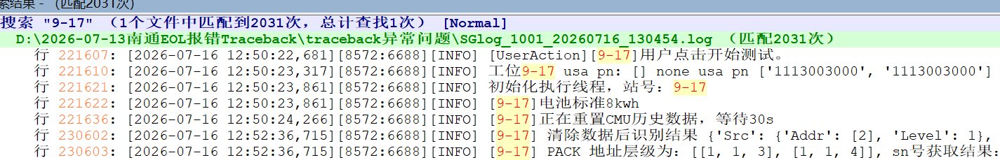

http://code.sigenpower.com:9092/sigenequip/micropackeoltest_system.git

1、金桥那边优化了 3 个，跑了快两天了，没啥异常，全投，我周一再去看下
2、跟吴哥再调加电包的测试工位，端头接错，焊锡脱焊问题，有个想法写个专利，工位后期自检流程
3、之前有个 traceback 报错定位了，是识别个数不一致
昨晚又发生一次，跟之前显现不一样，出现问题后，手动关闭，还会再跑几十分钟
[2026-07-16 12:50:22,681][8572:6688][INFO] [UserAction][9-17]用户点击开始测试。
[2026-07-16 12:54:57,959][8572:6688][INFO] [9-17]开始加热膜测试。
[2026-07-16 12:56:01,160][8572:6688][INFO] [9-17]加热膜测试结束。
[2026-07-16 12:56:01,160][8572:6688][INFO] [9-17]开始充放电测试。
