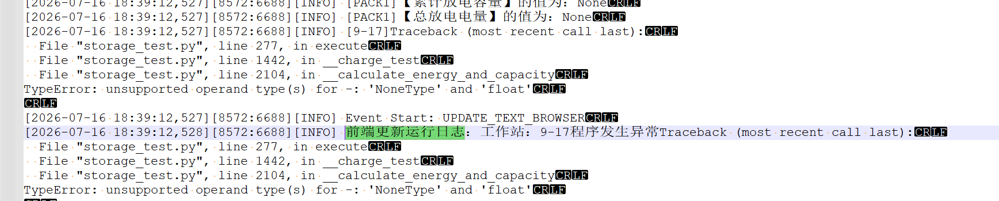
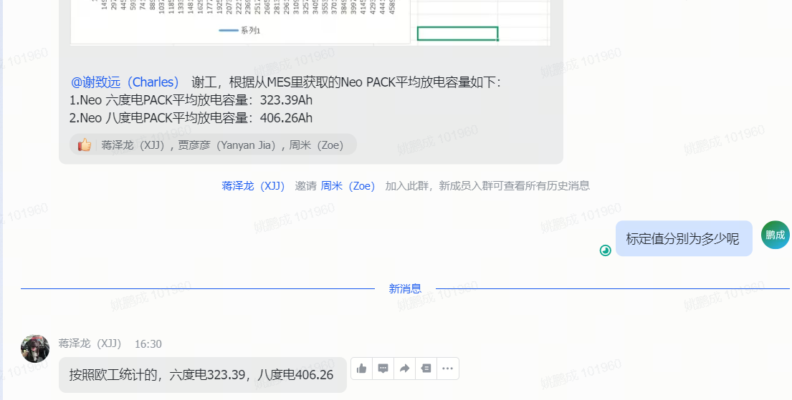

1、优化了回充容量的小数位显示
2、优化告警检查返回结果的显示
3、优化 MES 激活后获取不到固件版本， log 中异常显示
4、优化恢复出厂设置后微量掉电导致校验不通过问题

a 586 b 067 f 885 ceb 58 f 23 b 3 f 383794 bc 4677 ee 0 e 4
http://code.sigenpower.com:9092/sigen_equip/storage_test.git

http://code.sigenpower.com:9092/sigenequip/micropackeoltest_system.git

1、金桥那边优化了 3 个，跑了快两天了，没啥异常，全投，我周一再去看下
2、跟吴哥再调加电包的测试工位，端头接错，焊锡脱焊问题，有个想法写个专利，工位后期自检流程
3、之前有个 traceback 报错定位了，是识别个数不一致
昨晚又发生一次，跟之前显现不一样，出现问题后，手动关闭，还会再跑几十分钟
[2026-07-16 12:50:22,681][8572:6688][INFO] [UserAction][9-17]用户点击开始测试。
[2026-07-16 12:54:57,959][8572:6688][INFO] [9-17]开始加热膜测试。
[2026-07-16 12:56:01,160][8572:6688][INFO] [9-17]加热膜测试结束。
[2026-07-16 12:56:01,160][8572:6688][INFO] [9-17]开始充放电测试。
满充无 当前 SOC 打印
[2026-07-16 15:25:53,354][8572:6688][INFO] [9-17][PACK 1 120 B 94710201]判定【满充标志】的值：2，判定标准:满充满放标志等于 2，结果：True
[2026-07-16 15:25:53,354][8572:6688][INFO] [9-17][PACK 2 120 B 947 C 0580]判定【满充标志】的值：1，判定标准:满充满放标志等于 2，结果：True

[2026-07-16 15:26:23,883][8572:6688][INFO] [9-17][PACK 1 120 B 94710201]判定【满充标志】的值：2，判定标准:满充满放标志等于 2，结果：True
[2026-07-16 15:26:23,883][8572:6688][INFO] [9-17][PACK 2 120 B 947 C 0580]判定【满充标志】的值：2，判定标准:满充满放标志等于 2，结果：True
开始出现 error
[2026-07-16 18:20:18,352][8572:6688][INFO] [error][9-17][120 B 947 C 0580] 电池电压 返回值为 None 重试第 0 次

def export_data()
tmp_list = [time.strftime("%Y-%m-%d %H:%M:%S", time.localtime())] + \
                       self.data_export[self.pack_info_dict[tmp_inst].pack_sn]
self.pack_info_dict[tmp_inst] = PackInfo(pack_type, sn, pn, bn, version_pack)

def __get_parameter_check()
	def get_single_device_parameter_check()
		value = self.inst.get(tmp_inst, parameter, need_retry=need_retry)
		self.data_export[self.pack_info_dict[tmp_inst].pack_sn].append(value)

产线堆积
要快速测，减时，简化流程
明天给出版本，周五前要跑过
小于 40.6 就终止，电池实际容量标记为 408，根据 PN 进行控制（2 个 PN，8 度标记 408，）
既有 6 度电又有 8 度的

问题：
1、SOC 从 100%降到 40.6%，之间容量是否需要校验，若需要校验则校验区间应该为多少？
2、6 度和 8 度的 pn 号需要给下，不满足该 pn 号不进行测试

"1113002800":["6kwh", 150, 330]
"1113003000":["8kwh", 150, 388]

NEO 自杀流程，连续 15 次，间隔2s，开关断不开，硬件原因，
连续 10 次