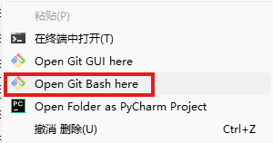

### 初始化本地仓库
在对应文件下打开 open git bash here

```python
# 1. 初始化本地 Git 仓库
git init
# 2. 关联远程仓库（粘贴你刚才复制的地址）
git remote add origin https://github.com/你的用户名/Obsidian-Notes.git
# 3. (可选但强烈推荐) 创建 .gitignore 文件，忽略 Obsidian 的临时配置文件，避免多设备冲突
# 在文件夹里新建一个 .gitignore 文件，把下面内容复制进去保存
.obsidian/workspace.json
.obsidian/workspace-mobile.json
.trash/
.DS_Store
```

### 首次提交与推送
```python
# 1. 初始化本地 Git 仓库
git init
# 2. 关联远程仓库（粘贴你刚才复制的地址）
git remote add origin https://github.com/你的用户名/Obsidian-Notes.git
# 3. (可选但强烈推荐) 创建 .gitignore 文件，忽略 Obsidian 的临时配置文件，避免多设备冲突
# 在文件夹里新建一个 .gitignore 文件，把下面内容复制进去保存
.obsidian/workspace.json
.obsidian/workspace-mobile.json
.trash/
.DS_Store
```

### 首次提交与推送
```python
# 添加所有文件到暂存区
git add .
# 提交，-m 后面是提交说明
git commit -m "首次提交"
# 将本地仓库的主分支名改为 main（GitHub 默认）
git branch -M main
# 推送到 GitHub 远程仓库，-u 是建立关联
git push -u origin main
```


### git查看当前用户的配置
```python
git config user.name
git config user.email
```

### git 修改账号信息
```python
git config --global user.name "你的名字"
git config --global user.email "你的邮箱@company.com"
```


