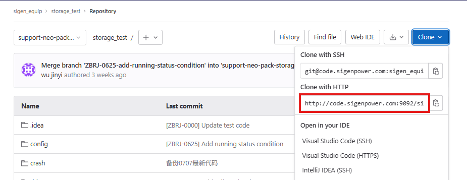

图里这个 HTTP 地址，**是整个 git 仓库的地址，它不会随页面切换分支而变化**。
同一个大门进去，可以进到不同房间（分支），代码内容就不一样。
页面只是网页 UI 显示当前浏览哪个分支，不会改变克隆 URL。

方式 1：直接 `git clone 地址`
git clone http://code.sigenpower.com:9092/xxx
只会拉取**默认分支**的代码，不管网页上你点开看的是哪个分支。

## 方式 2：clone 之后切换分支

```
# 1.克隆整个仓库
git clone http://code.sigenpower.com:9092/xxx
cd 项目文件夹

# 2.查看所有远程分支
git branch -r

# 3.切换到你想要的分支，这时候代码就变成该分支内容
git checkout 分支名
```

### 方式 3：直接克隆指定分支

```
git clone -b 分支名 http://code.sigenpower.com:9092/xxx
```

直接下载指定分支代码。


## 更新本地，切换到基础分支

```
#拉取远程最新所有分支信息
git fetch origin

#切换到基础分支（就是你网页上那个指定分支）
git checkout support-neo-pack-storage

#把本地这个分支更新到和远程完全同步，保证代码是最新
git pull origin support-neo-pack-storage
```

## 2. 基于当前分支，创建自己的本地分支

```
# 创建并且切换到自己的新分支
git checkout -b my-dev-branch
```

> 现在你的本地 `my-dev-branch` 分支代码就和基础分支一模一样，接下来在这里写你的业务代码

## 3. 修改完代码后，提交本地
```
#查看哪些文件被修改
git status

#把修改文件加入暂存 . 代表所有修改，也可以写具体文件名
git add .

#提交，写清楚提交备注
git commit -m "feat:这里填写本次修改内容"
```

## 4. 将本地新建分支推送到远程仓库（上库，网页就能看到这个新分支）
```
git push -u origin my-dev-branch
```

> `-u origin my-dev-branch`：设置本地分支和远程分支关联，以后 git push 直接推送，不用写完整命令

执行完，刷新你的 git 网页仓库，分支列表里面就能看到你新建的远程分支 `my-dev-branch`。