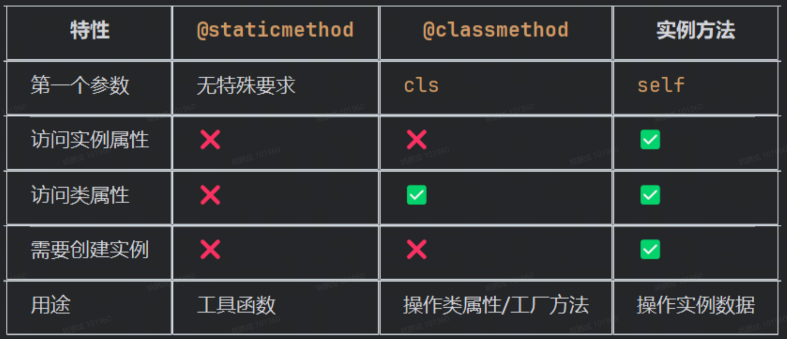

|                         |                                                        |                                  |
| ----------------------- | ------------------------------------------------------ | -------------------------------- |
| 方法                      | 描述                                                     | 备注                               |
| `patch.object`          | `unittest.mock` 模块中的函数，用于临时替换指定对象的某个属性或方法              | patch补丁                          |
| `with ... :`            | 上下文管理器，确保测试代码执行完后自动恢复原值                                | `with` 代码块内部的值被临时改写              |
| MagicMock               | 是“有求必应”的——你访问任何不存在的属性或方法，它都会自动创建并返回一个新的 `MagicMock` 对象 |                                  |
| `MagicMock` 有一些预留的特殊属性名 |                                                        |                                  |
| `return_value`          | 设置调用 Mock 对象时的返回值                                      | `mock.get.return_value = 200`    |
| `side_effect`           | 设置调用时的副作用（异常、多返回值、函数）                                  | `mock.post.side_effect = [1, 2]` |
| `call_count`            | 记录被调用的次数（只读）                                           | `print(mock.call_count)`         |
| `called`                | 是否被调用过（只读）                                             | `if mock.called:`                |
| `call_args`             | 最后一次调用的参数（只读）                                          | `mock.call_args`                 |
| `call_args_list`        | 所有调用记录（只读）                                             | `mock.call_args_list`            |
| `method_calls`          | 所有方法调用记录（只读）                                           | `mock.method_calls`              |
| `reset_mock()`          | 清空调用记录                                                 | `mock.reset_mock()`              |
|                         |                                                        |                                  |
## @staticmethod

@staticmethod 是 Python 的静态方法装饰器，表示这个方法不需要访问实例属性或类属性

特点：

❌ 不访问 self (实例属性)

❌ 不访问 cls (类属性)

✅ 只是恰好放在类中的普通函数

📞 调用方式：CommonFunction.hex_list([1,2,3]) 或 obj.hex_list([1,2,3])

非静态方法装饰器函数必须先创建实例才能调用

obj = CommonFunction()

result = obj.hex_list([7, 12, 56])

#### @classmethod

类方法 (@classmethod)

特点：

❌ 不访问 self (实例属性)

✅ 访问 cls (类属性，如 table_crc_hi, table_crc_lo)

📞 调用方式：CommonFunction.crc_16([0 x 01, 0 x 02])

CommonFunction.crc_16([0 x 01, 0 x 02, 0 x 03]) # 内部使用 cls.table_crc_hi/lo

#### 实例方法 (无装饰器)

特点：

✅ 访问 self (实例属性)

✅ 可以访问 cls (类属性)

📞 调用方式：obj.instance_method(data)

#### @abstractmethod

在 Python 中，`@abstractmethod` 是 `abc`（Abstract Base Class，抽象基类）模块提供的一个装饰器，用于声明抽象方法。抽象方法只有方法签名，没有具体实现（或仅提供可被子类覆盖的默认实现）。包含抽象方法的类称为抽象类，它不能被直接实例化，子类必须实现所有抽象方法后才能创建实例。