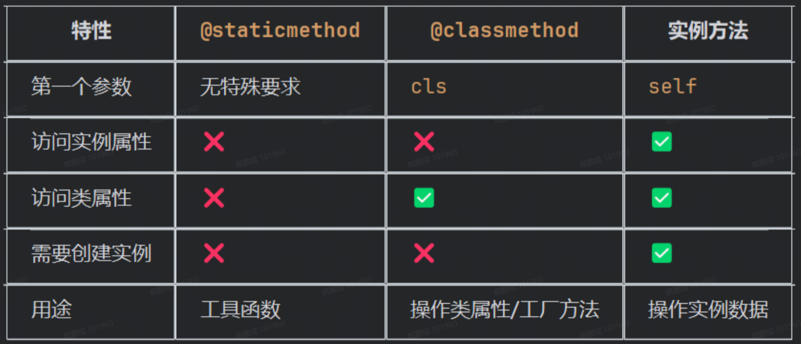

|                                        |                                                        |                                  |
| -------------------------------------- | ------------------------------------------------------ | -------------------------------- |
| 方法                                     | 描述                                                     | 备注                               |
| `patch.object`                         | `unittest.mock` 模块中的函数，用于临时替换指定对象的某个属性或方法              | patch补丁                          |
| `with ... :`                           | 上下文管理器，确保测试代码执行完后自动恢复原值                                | `with` 代码块内部的值被临时改写              |
| MagicMock                              | 是“有求必应”的——你访问任何不存在的属性或方法，它都会自动创建并返回一个新的 `MagicMock` 对象 |                                  |
| `MagicMock` 有一些预留的特殊属性名                |                                                        |                                  |
| `return_value`                         | 设置调用 Mock 对象时的返回值                                      | `mock.get.return_value = 200`    |
| `side_effect`                          | 设置调用时的副作用（异常、多返回值、函数）                                  | `mock.post.side_effect = [1, 2]` |
| `call_count`                           | 记录被调用的次数（只读）                                           | `print(mock.call_count)`         |
| `called`                               | 是否被调用过（只读）                                             | `if mock.called:`                |
| `call_args`                            | 最后一次调用的参数（只读）                                          | `mock.call_args`                 |
| `call_args_list`                       | 所有调用记录（只读）                                             | `mock.call_args_list`            |
| `method_calls`                         | 所有方法调用记录（只读）                                           | `mock.method_calls`              |
| `reset_mock()`                         | 清空调用记录                                                 | `mock.reset_mock()`              |
| now_time.strftime("%Y-%m-%d %H:%M:%S") | 格式化时间                                                  |                                  |
| sys.stdout.flush()                     | 强制把输出缓冲区的内容立即写到终端/文件，不等缓冲区满或程序结束。                      |                                  |
|                                        |                                                        |                                  |
# @staticmethod
@staticmethod 是 Python 的<mark style="background:#b1ffff">静态方法</mark>装饰器，表示这个方法不需要访问==实例属性==或==类属性==
特点：
❌ 不访问 self (实例属性)
❌ 不访问 cls (类属性)
✅ 只是恰好放在类中的普通函数
📞 调用方式：CommonFunction.hex_list([1,2,3]) 或 obj.hex_list([1,2,3])

非静态方法装饰器函数必须<mark style="background:#b1ffff">先创建实例</mark>才能调用
obj = CommonFunction()
result = obj.hex_list([7, 12, 56])
# @classmethod
类方法 (@classmethod)
特点：
❌ 不访问 self (实例属性)
✅ 访问 cls (类属性，如 table_crc_hi, table_crc_lo)
📞 调用方式：CommonFunction.crc_16([0 x 01, 0 x 02])
CommonFunction.crc_16([0 x 01, 0 x 02, 0 x 03]) # 内部使用 cls.table_crc_hi/lo

# 实例方法 (无装饰器)
特点：
✅ 访问 self (实例属性)
✅ 可以访问 cls (类属性)
📞 调用方式：obj.instance_method(data)


# @abstractmethod
在 Python 中，`@abstractmethod` 是 `abc`（Abstract Base Class，抽象基类）模块提供的一个装饰器，用于声明抽象方法。抽象方法只有方法签名，没有具体实现（或仅提供可被子类覆盖的默认实现）。包含抽象方法的类称为抽象类，它不能被直接实例化，子类必须实现所有抽象方法后才能创建实例。

# 保留两位小数
```python
f-string：result = f"{num:.2 f}"  # 最终为字符串
result = "{:.2f}".format(num)  # 最终为字符串
result = round(num, 2)  # 注意：可能不是"保留"而是四舍五入，最终为 float
% 格式化：result = "%.2 f" % num
Decimal（高精度场景）
from decimal import Decimal, ROUND_HALF_UP

num = Decimal('3.14159')
result = num.quantize(Decimal('0.01'), rounding=ROUND_HALF_UP)
```

# 睡眠等待
```python
time.sleep(60)
```

# 获取当前文件所在目录
```python
拿到当前文件所在目录：
os.path.dirname(os.path.abspath(__file__))
file_path = os.path.join(path, '', name)

os.getcwd() 返回“当前工作目录”的绝对路径。


```

# getattr()

```python
getattr(sys, 'frozen', False)

读取 sys 模块里有没有 frozen 这个属性
如果有，就取它的值
如果没有，就返回 False
它通常是用来判断“当前程序是不是打包成了可执行文件/冻结包”。
简单例子
import sys
print(getattr(sys, 'frozen', False))
如果你直接在 Python 源码里跑，通常会输出：
False
如果是打包后的程序运行，通常会输出：
True
一句话总结
它是在判断：当前是不是“打包运行”状态；如果是，就用打包目录中的资源文件，否则用源码目录中的配置文件。
这在打包部署场景里很常见，尤其是 PyInstaller / cx_Freeze 这类打包
if getattr(sys, 'frozen', False):
	***
elif __file__:
	***
	

```

# yml 文件加载
```python
safe_load 是 PyYAML 里推荐的安全方式，避免执行任意 Python 代码。
它比更通用的 yaml.load(...) 更安全，适合配置文件读取。
一句话总结
yaml.safe_load(f) 就是“把 YAML 文件内容安全地转换成 Python 对象，便于程序读取配置参数”。
```


# SYS 标准库

```python
### 命令行参数
sys.argv
命令行参数列表。`sys.argv[0]` 是脚本名，后面是传入的参数。
print(sys.argv)  # 运行 python script.py a b 得到 ['script.py', 'a', 'b']


### 标准输入输出流
sys.stdin/sys.stdout/sys.stderr
分别对应标准输入、标准输出、标准错误流。常用于重定向输出或读取输入。
sys.stdout.write("hello\n")   # 等价于 print，但不自动换行


### 程序退出
sys.exit([arg]) 
抛出 `SystemExit` 异常来终止程序。`arg` 为 0 或 `None` 表示正常退出，非 0 表示异常退出。
sys.exit(0)      # 正常退出
sys.exit("错误")  # 退出并打印错误信息，返回码为 1


### 路径与模块搜索
sys.path
模块搜索路径列表。可以动态添加路径，让 Python 找到自定义模块。
sys.path.append("/my/module/path")
sys.modules
已加载模块的字典，键是模块名，值是模块对象。可用于检查模块是否已导入。


### 解释器信息
sys.version
Python 解释器版本字符串（包含编译信息）。
sys.version_info
版本信息的具名元组，便于比较，如 `sys.version_info >= (3, 10)`。
sys.platform
运行平台标识，如 `'win32'`、`'linux'`、`'darwin'`。常用于跨平台判断。
sys.executable
当前 Python 解释器的可执行文件路径。在子进程中重新调用 Python 时很有用。
sys.prefix/sys.exec_prefix
Python 安装目录前缀。


### 内存与对象
sys.getsizeof(obj)
返回对象占用的字节数（含对象本身，不含其引用的对象）。
sys.getsizeof([1, 2, 3])  # 返回列表对象本身的大小
sys.getrecursionlimit()/sys.setrecursionlimit(n)
获取/设置递归深度限制，默认通常为 1000。

### 引用计数与垃圾回收
sys.getrefcount(obj)
返回对象的引用计数。注意传入参数本身会临时增加一次计数。
sys.intern(string)
将字符串加入内部驻留池，加速相同字符串的比较。


### 异常信息
sys.exc_info()
返回当前正在处理的异常信息三元组 `(type, value, traceback)`。在 `except` 块中使用。
sys.last_traceback
最后一次未捕获异常的 traceback 对象（交互模式下可用）。


### 其他常用
sys.float_info
浮点数相关的精度和范围信息，如 `sys.float_info.epsilon`。
sys.maxsize
当前平台上 `Py_ssize_t` 类型的最大值，常用来表示"无限大"的整数。
sys.byteorder
字节序，`'little'` 或 `'big'`。
sys.flags
命令行标志的具名元组，如是否启用优化、是否处于交互模式等。


sys.stdout.flush() 会把缓冲区里的输出立即刷新到终端 / 控制台。

````


